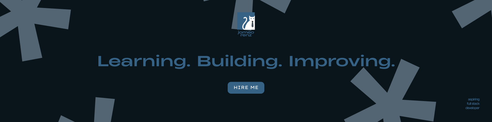

  

##

  <ul align="center" style="list-style: none">
    

      <h1>
        Hi, I'm Jomeo! Welcome to my Github! 👋
      </h1>
    

  </ul>

##

I’m an aspiring developer with a strong interest in technology and problem-solving. I mainly focus on web development and programming, and I enjoy building projects that are both functional and thoughtfully designed. I’m always eager to learn, experiment, and grow through hands-on work.

  
    

###

##

###

<h3 align="left">💡 Languages & Frameworks</h3>

  
  
  
  
  
  
  
  

###

##

###

<h3 align="left">⚡ Tools & Platforms</h3>

  
  
  
  

###

##

###

<h3 align="left">🌟 Skills</h3>

  
  
  
  
  
  
